# 🗺️ JORNADA DO USUÁRIO - REPRESENTAÇÃO GRÁFICA
## SPA - Sistema de Perfil Discente (FMPSC)

---

## 📊 DIAGRAMAS INTERATIVOS (Mermaid)

Os diagramas abaixo podem ser visualizados em:
- GitHub/GitLab (renderização automática)
- [Mermaid Live Editor](https://mermaid.live)
- Extensões do VS Code (Markdown Preview Mermaid Support)
- Ferramentas que suportam Mermaid

---

## 1. JORNADA COMPLETA DO USUÁRIO

```mermaid
graph TD
    Start([Usuário Acessa o Sistema]) --> Home[/]
    Home --> Login[Página de Login]
    
    Login -->|Novo Usuário| Cadastro[Página de Cadastro]
    Login -->|Já Cadastrado| LoginForm[Preenche Email e Senha]
    Login -->|Esqueceu Senha| Recuperar[Recuperar Senha]
    
    Cadastro --> CadastroForm[Preenche Formulário]
    CadastroForm -->|Validações OK| CriarConta[Cria Conta no Sistema]
    CadastroForm -->|Erro| Cadastro
    CriarConta --> EmailBoasVindas[Envia Email de Boas-vindas]
    EmailBoasVindas --> Login
    
    LoginForm -->|Credenciais Válidas| Autenticado[Usuário Autenticado]
    LoginForm -->|Credenciais Inválidas| Login
    
    Recuperar --> RecuperarForm[Informa Email]
    RecuperarForm -->|Email Encontrado| TokenEmail[Gera Token e Envia Email]
    RecuperarForm -->|Email Não Encontrado| Login
    TokenEmail --> ResetSenha[Página Reset Senha]
    ResetSenha --> NovaSenha[Define Nova Senha]
    NovaSenha -->|Sucesso| Login
    
    Autenticado --> Analises[Módulo de Análises]
    
    Analises -->|Admin| Upload[Upload de CSV]
    Analises --> SelecionarArquivo[Seleciona Arquivo CSV]
    
    Upload --> SalvarArquivo[Arquivo Salvo]
    SalvarArquivo --> Analises
    
    SelecionarArquivo --> CarregarColunas[Carrega Colunas do CSV]
    CarregarColunas --> Configurar[Configura Análise]
    
    Configurar -->|Simples| GerarGrafico[Gera Gráfico]
    Configurar -->|Comparar| CompararArquivos[Seleciona Arquivo para Comparar]
    
    CompararArquivos --> GerarComparacao[Gera Gráficos Comparativos]
    GerarGrafico --> Visualizar[Visualiza Gráficos]
    GerarComparacao --> Visualizar
    
    Visualizar -->|Download| DownloadPNG[Baixa Gráfico PNG]
    Visualizar -->|Novo Gráfico| Configurar
    Visualizar -->|Logout| Logout[Sair do Sistema]
    
    DownloadPNG --> Visualizar
    Logout --> Login
    
    style Start fill:#e1f5ff
    style Autenticado fill:#c8e6c9
    style Analises fill:#fff9c4
    style Visualizar fill:#f3e5f5
    style Login fill:#ffccbc
```

---

## 2. FLUXO DE AUTENTICAÇÃO

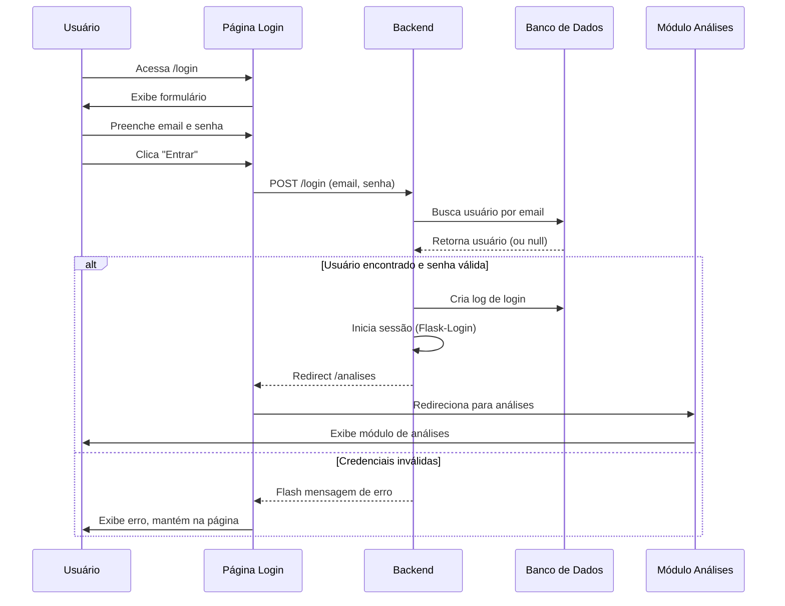

---

## 3. FLUXO DE CADASTRO

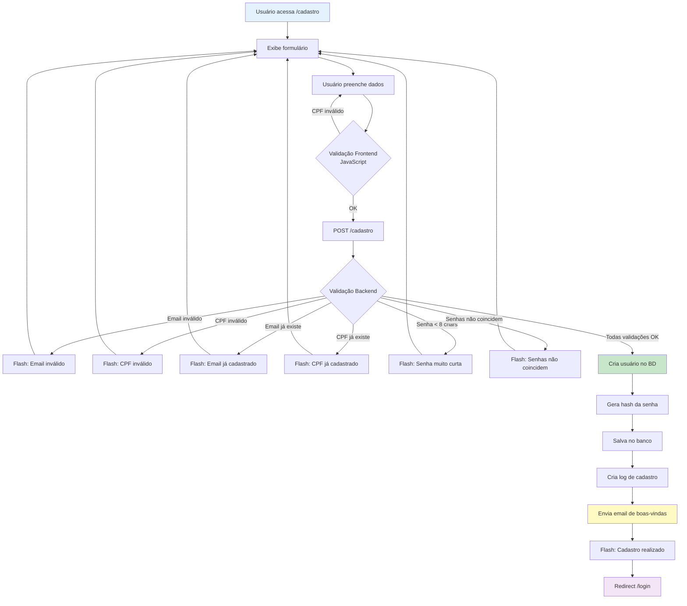

---

## 4. FLUXO DE RECUPERAÇÃO DE SENHA

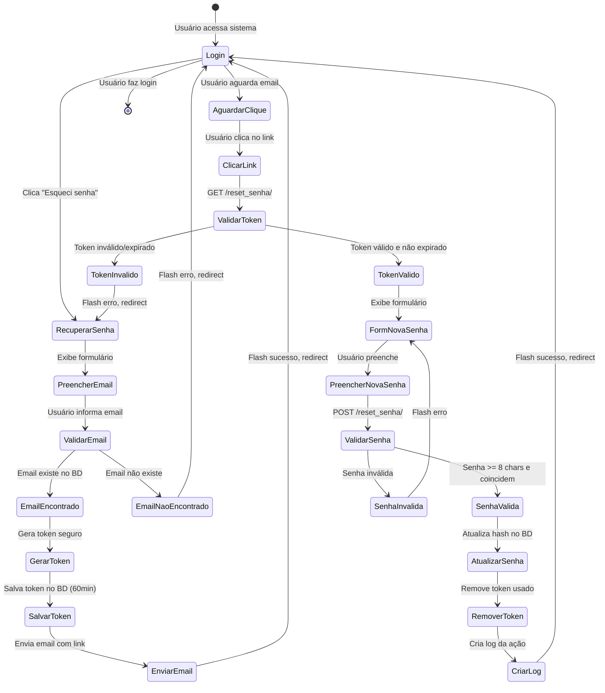

---

## 5. FLUXO DE ANÁLISES E GRÁFICOS

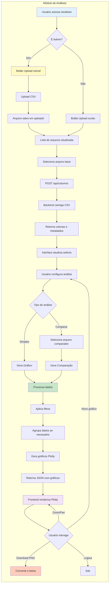

---

## 6. JORNADA DO USUÁRIO NOVO (User Journey)

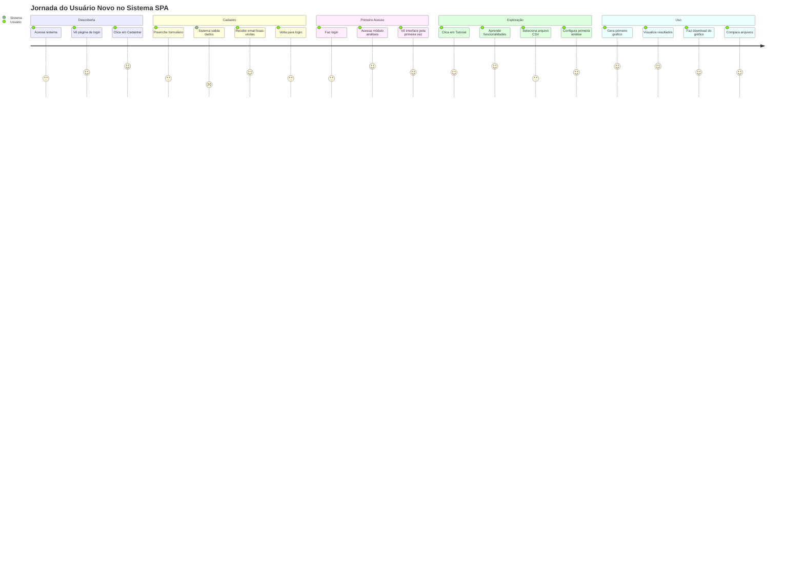

---

## 7. FLUXO DE COMPARAÇÃO DE ARQUIVOS

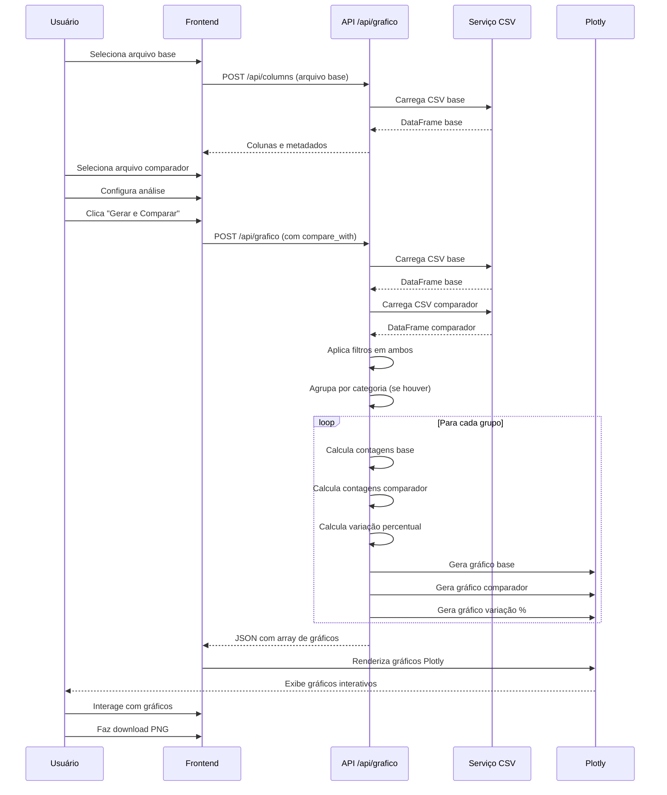

---

## 8. MAPA DE ESTADOS DO SISTEMA

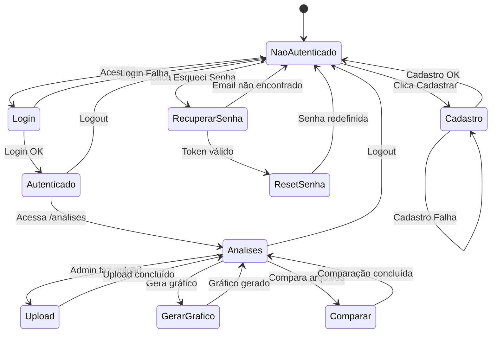

---

## 9. DIAGRAMA DE COMPONENTES E INTERAÇÕES

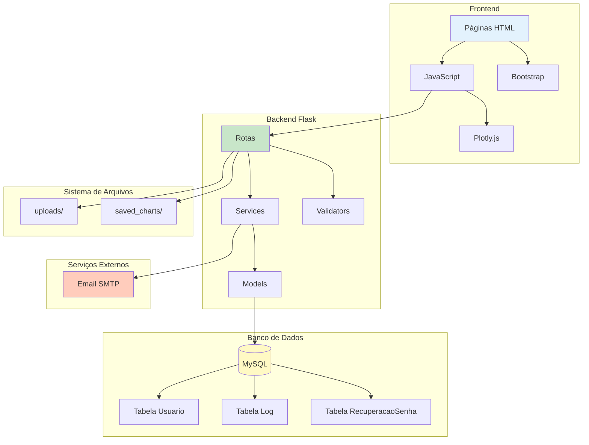

---

## 10. FLUXO DE PERMISSÕES E ACESSO

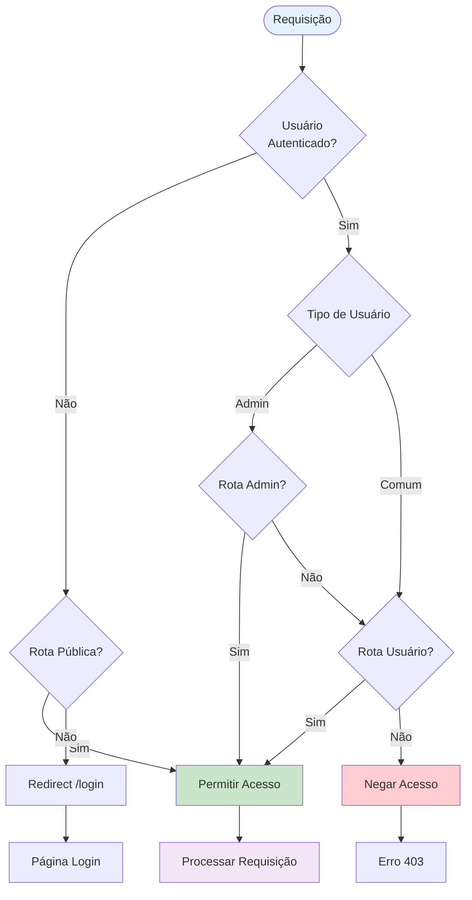

---

## 📈 DIAGRAMAS ASCII ART (Alternativa Visual)

### Jornada Principal - Versão ASCII

```
┌─────────────────────────────────────────────────────────────────┐
│                    🏠 PONTO DE ENTRADA                          │
│                         (/) Home                                │
└────────────────────────────┬────────────────────────────────────┘
                              │
                              ▼
                    ┌──────────────────┐
                    │  🔐 LOGIN        │
                    │  /login          │
                    └────────┬─────────┘
                             │
        ┌────────────────────┼────────────────────┐
        │                    │                    │
        ▼                    ▼                    ▼
┌───────────────┐   ┌───────────────┐   ┌───────────────┐
│ 📝 CADASTRO   │   │ ✅ LOGIN OK   │   │ 🔑 RECUPERAR  │
│ /cadastro     │   │               │   │ /recuperar_   │
└───────┬───────┘   └───────┬───────┘   │ senha         │
        │                   │           └───────┬───────┘
        │                   │                   │
        ▼                   │                   │
┌───────────────┐           │                   │
│ 📧 Email      │           │                   │
│ Boas-vindas   │           │                   │
└───────┬───────┘           │                   │
        │                   │                   │
        └───────────┬───────┴───────────────────┘
                    │
                    ▼
            ┌───────────────┐
            │ ✅ AUTENTICADO │
            └───────┬───────┘
                    │
                    ▼
        ┌───────────────────────┐
        │  📊 MÓDULO ANÁLISES   │
        │  /analises            │
        └───────────┬───────────┘
                    │
    ┌───────────────┼───────────────┐
    │               │               │
    ▼               ▼               ▼
┌─────────┐   ┌──────────┐   ┌──────────┐
│ 📤 UPLOAD│   │ 📈 GRÁFICO│   │ 🔄 COMPARAR│
│ (Admin) │   │ Simples   │   │ Arquivos  │
└────┬────┘   └─────┬─────┘   └─────┬────┘
     │              │               │
     │              └───────┬───────┘
     │                      │
     └──────────┬───────────┘
                │
                ▼
        ┌───────────────┐
        │ 🎨 VISUALIZAR  │
        │ Gráficos       │
        └───────┬───────┘
                │
    ┌───────────┼───────────┐
    │           │           │
    ▼           ▼           ▼
┌────────┐  ┌────────┐  ┌────────┐
│ 📥 PNG │  │ 🔄 NOVO│  │ 🚪 SAIR│
│ Download│  │ Gráfico│  │ Logout │
└────────┘  └────────┘  └────────┘
```

---

## 🎯 PERSONAS E JORNADAS

### Persona 1: Estudante (Usuário Novo)

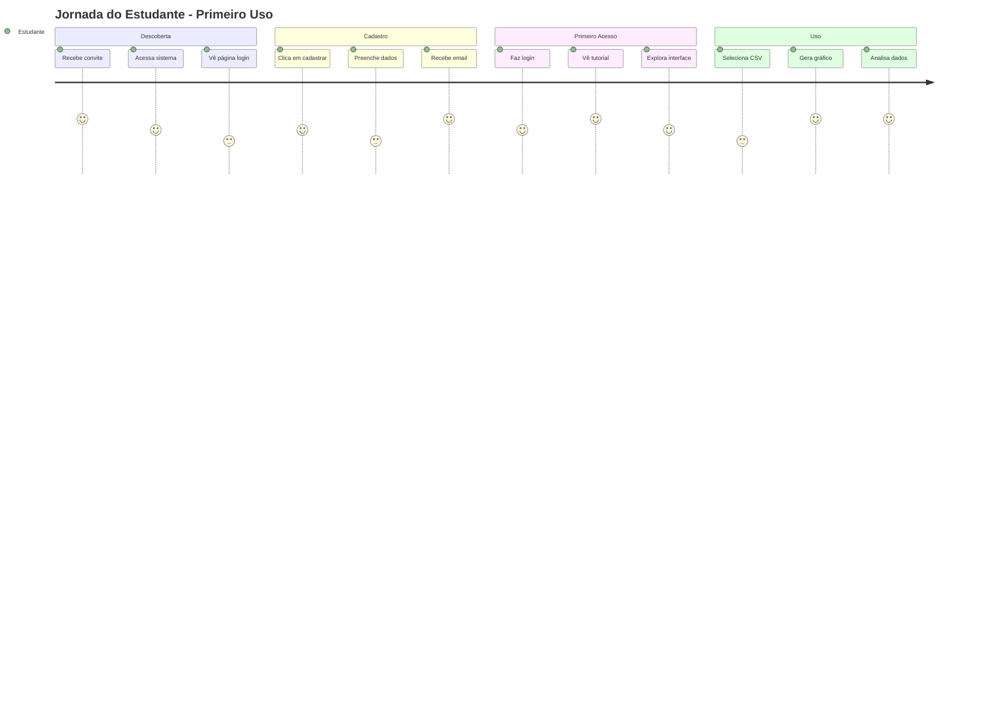

### Persona 2: Administrador

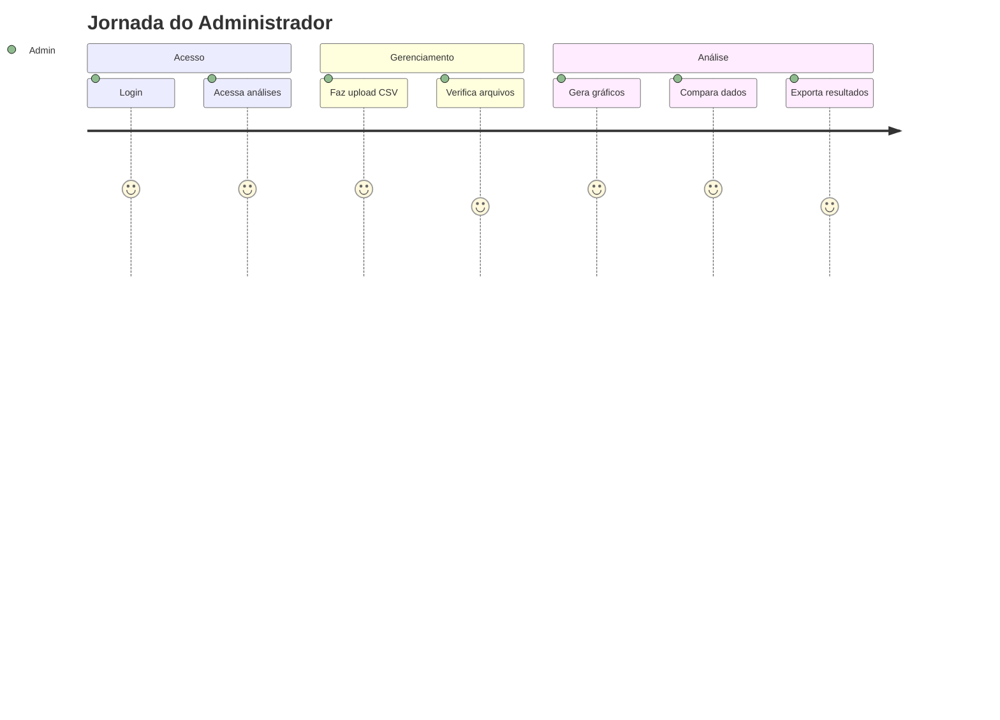

---

## 📱 RESPONSIVIDADE E DISPOSITIVOS

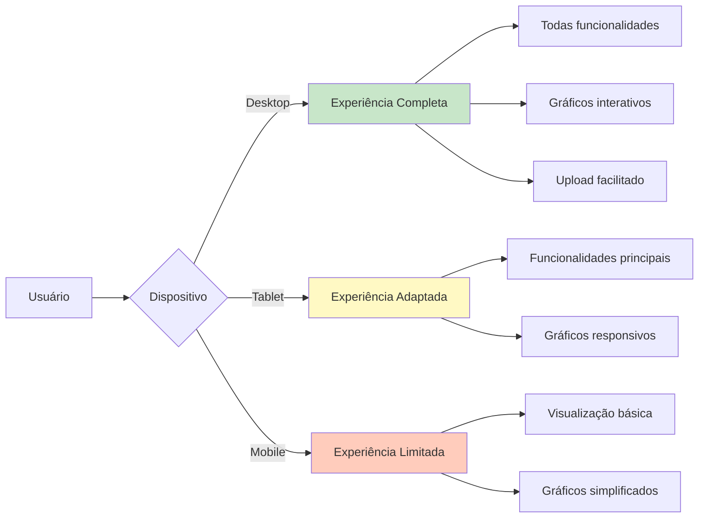

---

## 🔄 CICLO DE VIDA DA SESSÃO

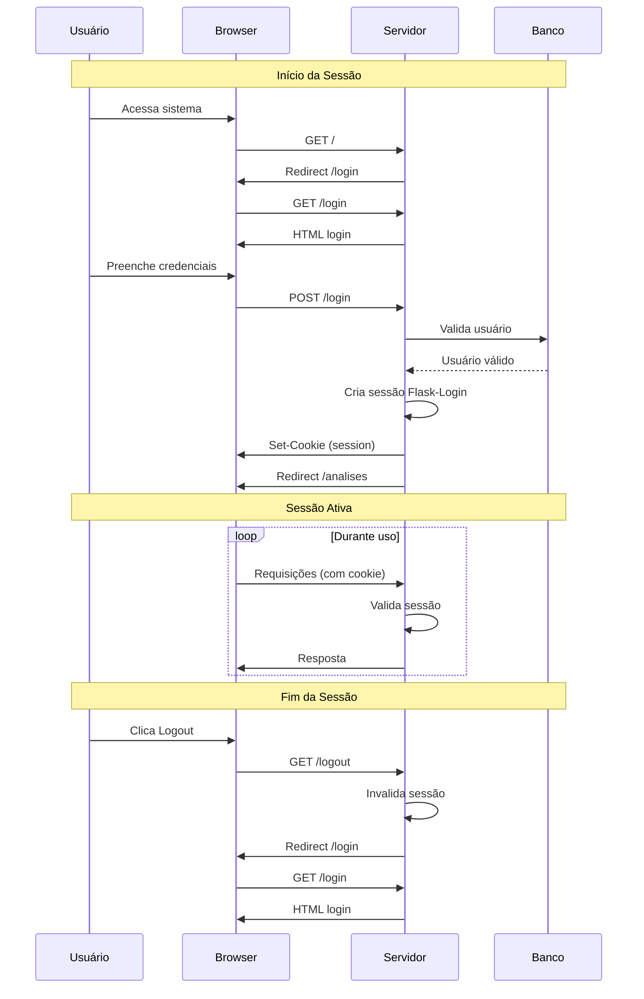

---

## 📊 MÉTRICAS DE NAVEGAÇÃO

### Tempo Médio por Fluxo

| Fluxo | Tempo Estimado | Complexidade |
|-------|---------------|--------------|
| Cadastro | 2-3 min | Média |
| Login | 10-15 seg | Baixa |
| Recuperação Senha | 3-5 min | Média |
| Gerar Gráfico Simples | 1-2 min | Baixa |
| Comparar Arquivos | 2-3 min | Média |
| Upload CSV | 30 seg | Baixa |

### Taxa de Conversão Esperada

```
Cadastro → Login: 90%
Login → Análises: 95%
Análises → Primeiro Gráfico: 70%
Primeiro Gráfico → Uso Regular: 60%
```

---

## 🎨 LEGENDA DOS DIAGRAMAS

### Cores e Significados

- 🔵 **Azul Claro**: Ponto de entrada, início
- 🟢 **Verde**: Ações bem-sucedidas, autenticação
- 🟡 **Amarelo**: Processamento, análise
- 🟣 **Roxo**: Visualização, resultados
- 🟠 **Laranja**: Ações do usuário
- 🔴 **Vermelho**: Erros, bloqueios

### Símbolos

- 📊 Gráficos e análises
- 🔐 Autenticação
- 📝 Cadastro
- 📧 Email
- 📤 Upload
- 📥 Download
- 🔄 Processamento
- ✅ Sucesso
- ❌ Erro

---

**Documento gerado em**: 2024  
**Formato**: Mermaid Diagrams + ASCII Art  
**Compatibilidade**: GitHub, GitLab, VS Code, Mermaid Live Editor

